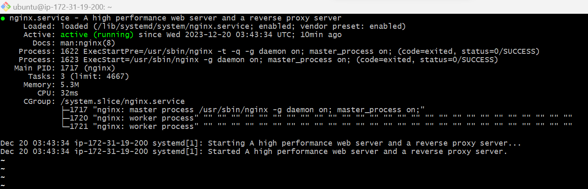

sudo apt update

sudo apt install nginx

sudo systemctl status nginx

nginx-status

-install openssh

-openssh-key-management

curl http://localhost:80

http://<Public-IP-Address>:80 I opened a web browser of my choice and try to access the url to test how Apache HTTP server can respond to requests from the Internet

-[Alternative-method-of-getting-public-ip](curl -s http://169.254.169.254/latest/meta-data/public-ipv4)

sudo apt install mysql-server

sudo mysql

ALTER USER 'root'@'localhost' IDENTIFIED WITH mysql_native_password BY 'PassWord.1';

sudo mysql_secure_installation

sudo mysql -p

sudo apt install php libapache2-mod-php php-mysql

sudo mkdir /var/www/projectLEMP

sudo chown -R $USER:$USER /var/www/projectLEMP

sudo nano /etc/nginx/sites-available/projectLEMP

sudo ln -s /etc/nginx/sites-available/projectLEMP /etc/nginx/sites-enabled/

sudo nginx -t

sudo unlink /etc/nginx/sites-enabled/default

sudo systemctl reload nginx

sudo sh -c 'echo "Hello LEMP from hostname $(curl -s http://169.254.169.254/latest/meta-data/public-hostname) with public IP $(curl -s http://169.254.169.254/latest/meta-data/public-ipv4)" > /var/www/projectLEMP/index.html'

sudo nano /var/www/projectLEMP/info.php

http://server_domain_or_IP/info.php [pasted on browser]

sudo rm /var/www/your_domain/info.php

CREATE DATABASE example_database;

CREATE USER 'example_user'@'%' IDENTIFIED WITH mysql_native_password BY 'PassWord.2';

GRANT ALL ON example_database.* TO 'example_user'@'%';

SHOW DATABASES;

SELECT * FROM example_database.todo_list;

nano /var/www/projectLEMP/todo_list.php