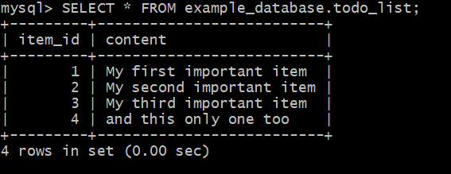

#Create the table
CREATE TABLE example_database.todo_list (
    item_id INT AUTO_INCREMENT,
    content VARCHAR(255),
    PRIMARY KEY(item_id)
);

INSERT INTO example_database.todo_list (content) VALUES ("My first important item");
INSERT INTO example_database.todo_list (content) VALUES ("My second important item");
INSERT INTO example_database.todo_list (content) VALUES ("My third important item");
INSERT INTO example_database.todo_list (content) VALUES ("and this only one too");

SELECT * FROM example_database.todo_list;

